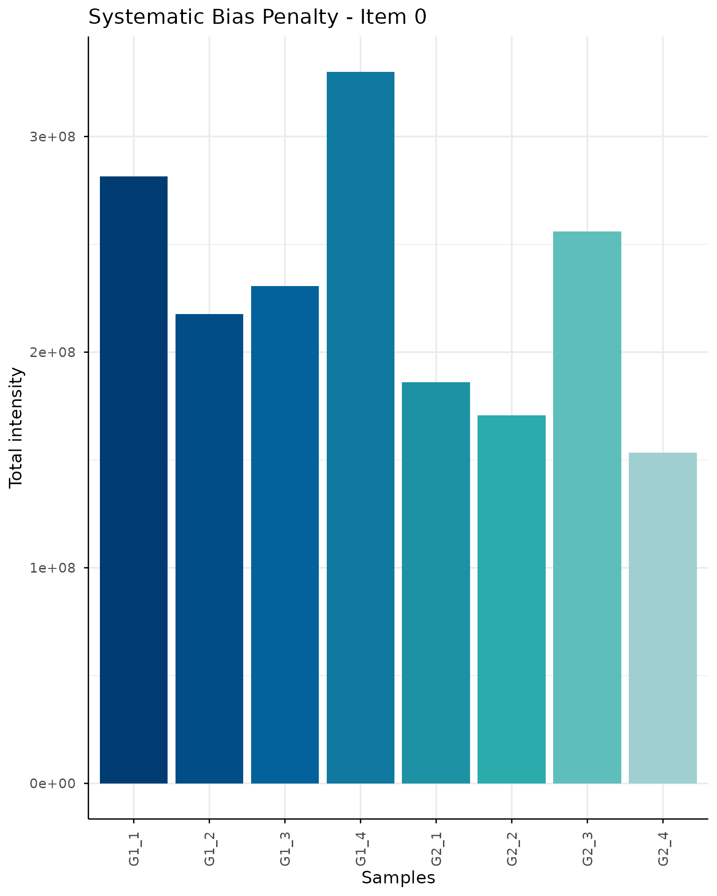
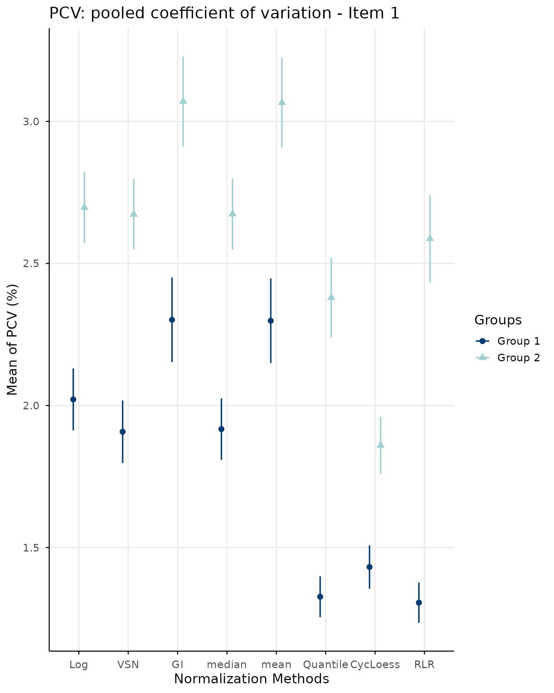
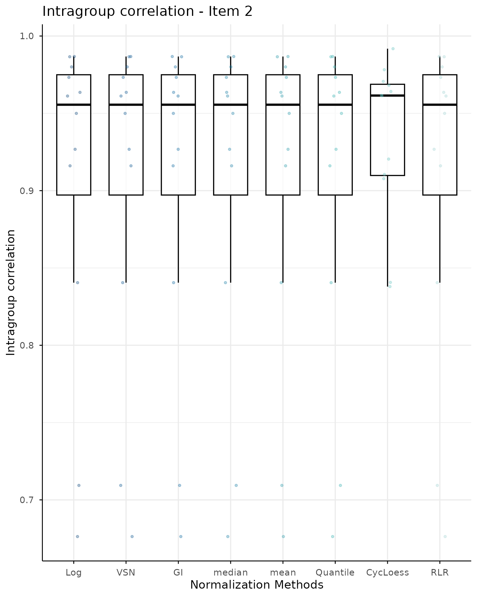
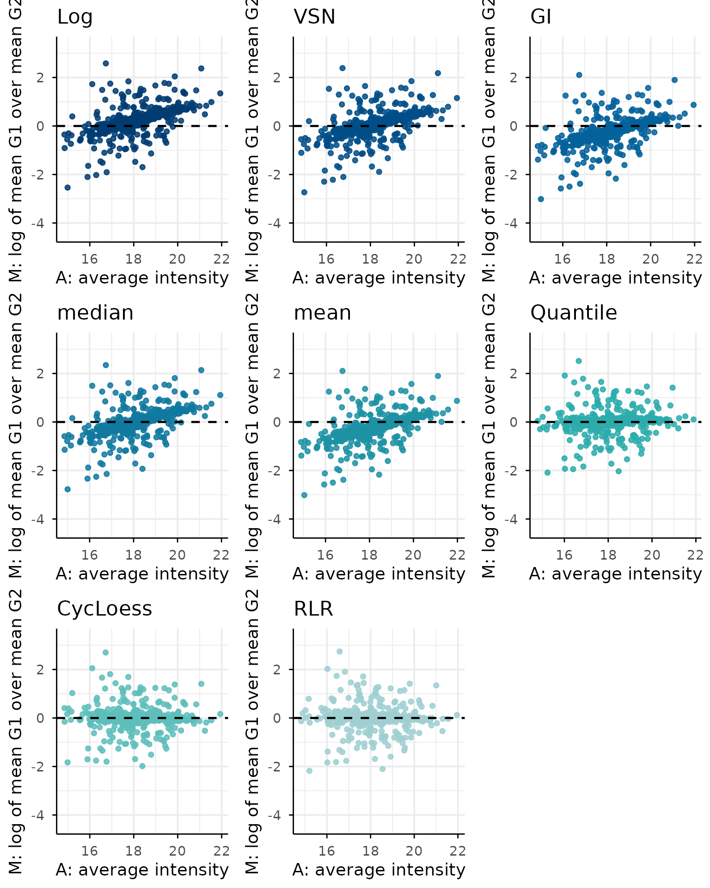
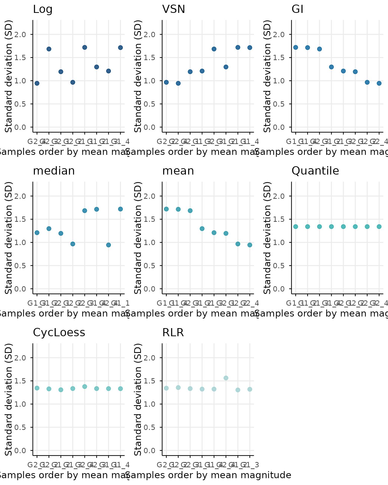
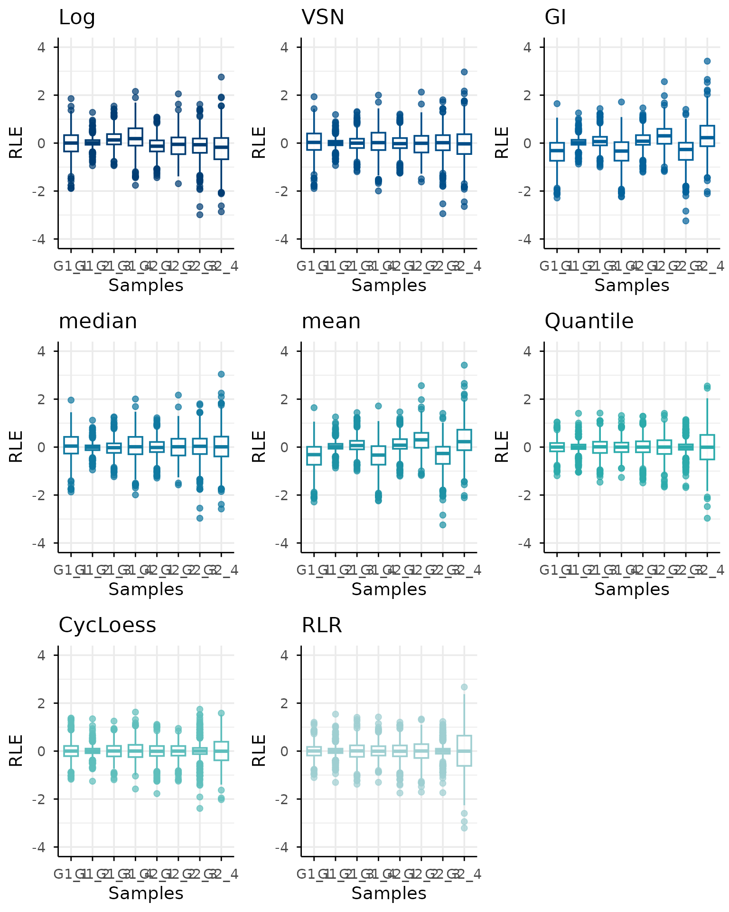
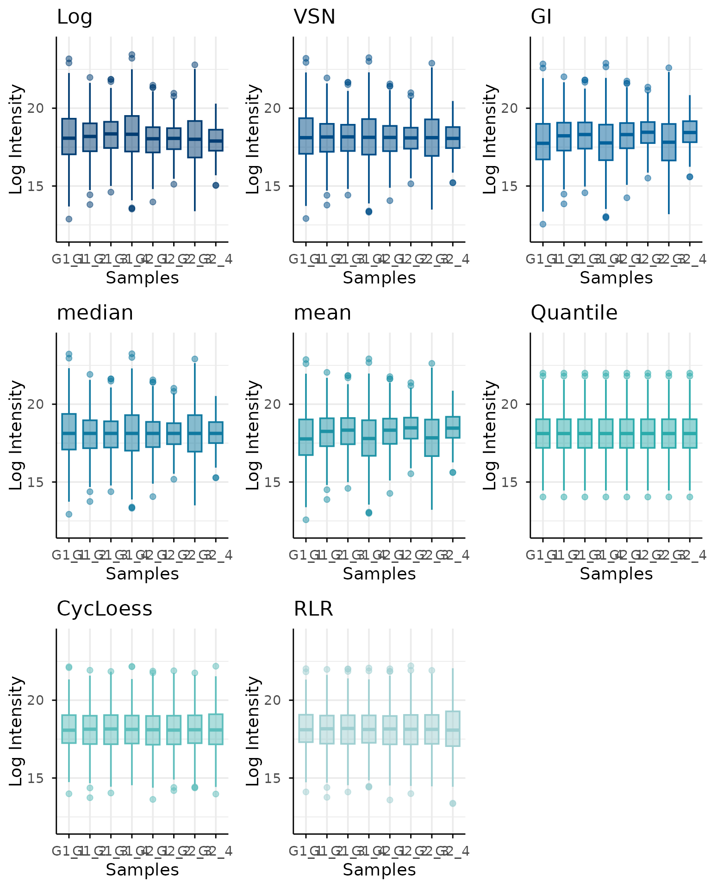

# NormScore with SummarizedExperiment and NormalyzedDE

## Introduction

`SummarizedExperiment` is a standard Bioconductor container for storing
high-dimensional molecular data together with feature and sample
metadata. A single object can contain several assays, making it
convenient for keeping the original data and multiple normalized
versions aligned.

This vignette illustrates how to:

1.  create a `SummarizedExperiment` object;
2.  store several normalized matrices as assays;
3.  extract the matrices and sample groups required by `normScore`;
4.  evaluate the normalization methods;
5.  add the resulting scores back to the object metadata.

## Required packages

``` r

library(normScore)
library(SummarizedExperiment)
```

The packages used only in this vignette should be included in the
`Suggests` field of the package `DESCRIPTION` file:

``` text
Suggests:
    BiocStyle,
    knitr,
    rmarkdown,
    SummarizedExperiment
VignetteBuilder: knitr
```

## Example data

For illustration, we generate a small log-transformed abundance matrix
using `simulateData` function from `normScore` data package.

Rows represent proteins and columns represent samples in logData and
rawData items from the output `simData` object.

``` r

simData <- simulateData(
    nProteins = 500,
    nPerGroup = 4,
    sampleShiftSd = 0.12,
    sampleShiftCap = 1,
    sampleSdStrength = 1.2,
    sampleSdRho = 0.3,
    rhoWithin = 0.6,
    rhoBetween = 0.3,
    loadingSd = 0.45,
    sigmaHi = 0.03,
    sigmaLo = 0.4,
    gammaSigma = 3.8,
    kMnar = 1.6,
    addMissing = FALSE,
    seed = 456
)

rawData <- simData$rawData
```

## Build a SummarizedExperiment object

The original and normalized matrices are stored as separate assays.
Sample-level information is stored in `colData`, whereas optional
feature-level annotations can be stored in `rowData`.

``` r

sampleData <- S4Vectors::DataFrame(
    sample = simData$metadata$Samples,
    group = simData$metadata$Groups
)

se <- SummarizedExperiment::SummarizedExperiment(
    assays = list(rawData = rawData),
    colData = sampleData,
    metadata = list(
        sample = "sample",
        group = "group")
)
```

## Normalization using NormalyzerDE

Using normalyzerDE different normalization methods are simultaneously
applied to the input data.

``` r

normalyzerObject <- NormalyzerDE::getVerifiedNormalyzerObject(
    jobName = "normScore_example",
    summarizedExp = se,
    noLogTransform = FALSE
)

normalyzerResults <- NormalyzerDE::normMethods(
    normalyzerObject,
    normalizeRetentionTime = FALSE
)
```

## Prepare normScore inputs

`normScore` evaluates a named list of matrices. We therefore extract the
normalized assays from the `SummarizedExperiment` object.

``` r

normalizedDataList <- methods::slot(
    normalyzerResults,
    "normalizations"
)
```

Setting rownames as some normalized matrices from normalyzerDE lost
protein rownames:

``` r

normalizedDataList <- lapply(
    normalizedDataList,
    function(x) {
        rownames(x) <- rownames(rawData)
        x
    }
)
```

The group information is constructed from `colData`. The sample order
must match the matrix columns.

``` r

groupData <- data.frame(
    Samples = sampleData$sample,
    Groups = sampleData$group
)

stopifnot(
    identical(groupData$Samples, colnames(rawData)),
    all(vapply(
        normalizedDataList,
        function(x) identical(colnames(x), groupData$Samples),
        logical(1)
    ))
)

groupData
#>   Samples Groups
#> 1    G1_1     G1
#> 2    G1_2     G1
#> 3    G1_3     G1
#> 4    G1_4     G1
#> 5    G2_1     G2
#> 6    G2_2     G2
#> 7    G2_3     G2
#> 8    G2_4     G2
```

## Run normScore

The extracted objects can now be supplied to `normScore`.

Depending on the final argument names of the exported
[`normScore()`](https://juliagcurras.github.io/normScore/reference/normScore.md)
function, this call may need to be adapted to the current package API.

The returned object can be inspected directly:

For example, the score or ranking table can be displayed after selecting
the corresponding component returned by the package:

Similarly, diagnostic plots can be accessed from the plotting component:

- `normScoreResults`` ``<-`` `[`normScore`](https://juliagcurras.github.io/normScore/reference/normScore.md)`(`` `` normalizedDataList ``=`` ``normalizedDataList``,`` `` groupData ``=`` ``groupData``,`` `` rawData ``=`` ``rawData`` ``)`
- [`names`](https://rdrr.io/r/base/names.html)`(``normScoreResults``)`` ``#> [1] "finalRanking" "detailRanking" "bootstrapScore"`` `` ``normScoreResults``$``finalRanking`` ``#> CycLoess Quantile RLR median VSN Log mean GI `` ``#> 0.1146664 0.5337718 0.8057344 2.6233468 3.2082820 3.5259282 5.0300702 5.0353495`
- `normScoreResults``$``detailRanking`` ``#> Item1 Item2 Item3 Item4 Item5 Item6 Total`` ``#> CycLoess 0.0000000 0.0 0.00000000 0.005642598 0.0000000 0.1090238 0.1146664`` ``#> Quantile 0.1995836 0.1 0.12108497 0.000000000 0.1131033 0.0000000 0.5337718`` ``#> RLR 0.2891989 0.1 0.03355444 0.024553161 0.1786779 0.1797500 0.8057344`` ``#> median 0.6245702 0.1 0.90508889 0.381038667 0.1323728 0.4802762 2.6233468`` ``#> VSN 0.6193697 0.1 0.91274714 0.922820559 0.1407907 0.5125538 3.2082820`` ``#> Log 0.6859264 0.1 1.00000000 0.380046812 0.5158417 0.7027628 3.3845777`` ``#> mean 0.9961761 0.1 0.93534954 1.000000000 1.0000000 0.9985446 5.0300702`` ``#> GI 1.0000000 0.1 0.93534954 1.000000000 1.0000000 1.0000000 5.0353495`` ``#> TotalxItem0`` ``#> CycLoess 0.1146664`` ``#> Quantile 0.5337718`` ``#> RLR 0.8057344`` ``#> median 2.6233468`` ``#> VSN 3.2082820`` ``#> Log 3.5259282`` ``#> mean 5.0300702`` ``#> GI 5.0353495`
- `allPlots`` ``<-`` `[`plotNormScoreDiagnostics`](https://juliagcurras.github.io/normScore/reference/plotNormScoreDiagnostics.md)`(`` `` normalizedDataList ``=`` ``normalizedDataList``, `` `` groupData ``=`` ``groupData``, `` `` rawData ``=`` ``rawData`` ``)`
- item0
- item1
- item2
- item3
- item4
- item5
- item6















## Store results in the SummarizedExperiment metadata

Analysis-level information that is not naturally associated with
individual features or samples can be stored in `metadata(se)`.

``` r

metadata(se)$normScore <- normScoreResults
```

The results can then be recovered without separating them from the data:

``` r

storedResults <- metadata(se)$normScore
names(storedResults)
#> [1] "finalRanking"   "detailRanking"  "bootstrapScore"
```

A compact summary table may also be stored separately:

``` r

metadata(se)$normalizationRanking <- normScoreResults$score
```

## Add a selected normalized assay

Once a normalization method has been selected, its matrix can remain as
an assay of the same object. For example, if median normalization is
selected:

``` r

assay(se, "Selected") <- normalizedDataList$Quantile

assayNames(se)
#> [1] "rawData"  "Selected"
```

The selected assay can then be used in downstream Bioconductor
workflows:

``` r

selectedData <- assay(se, "Selected")

dim(selectedData)
#> [1] 500   8
```

## Working with an existing SummarizedExperiment

For an existing object, the minimum workflow is:

``` r

assayNames(se)
colnames(se)
colData(se)

rawData <- assay(se, "Unnormalized")

normalizationMethods <- c("Mean", "Median", "Quantile")

normalizedDataList <- lapply(
    normalizationMethods,
    function(method) assay(se, method)
)
names(normalizedDataList) <- normalizationMethods

groupData <- data.frame(
    Samples = colnames(se),
    Groups = as.character(colData(se)$group)
)

normScoreResults <- normScore(
    normalizedDataList = normalizedDataList,
    groupData = groupData,
    rawData = rawData
)

metadata(se)$normScore <- normScoreResults
```

## Session information

``` r

sessionInfo()
#> R version 4.6.1 (2026-06-24)
#> Platform: x86_64-pc-linux-gnu
#> Running under: Ubuntu 24.04.4 LTS
#> 
#> Matrix products: default
#> BLAS:   /usr/lib/x86_64-linux-gnu/openblas-pthread/libblas.so.3 
#> LAPACK: /usr/lib/x86_64-linux-gnu/openblas-pthread/libopenblasp-r0.3.26.so;  LAPACK version 3.12.0
#> 
#> locale:
#>  [1] LC_CTYPE=C.UTF-8       LC_NUMERIC=C           LC_TIME=C.UTF-8       
#>  [4] LC_COLLATE=C.UTF-8     LC_MONETARY=C.UTF-8    LC_MESSAGES=C.UTF-8   
#>  [7] LC_PAPER=C.UTF-8       LC_NAME=C              LC_ADDRESS=C          
#> [10] LC_TELEPHONE=C         LC_MEASUREMENT=C.UTF-8 LC_IDENTIFICATION=C   
#> 
#> time zone: UTC
#> tzcode source: system (glibc)
#> 
#> attached base packages:
#> [1] stats4    stats     graphics  grDevices utils     datasets  methods  
#> [8] base     
#> 
#> other attached packages:
#>  [1] SummarizedExperiment_1.42.0 Biobase_2.72.0             
#>  [3] GenomicRanges_1.64.0        Seqinfo_1.2.0              
#>  [5] IRanges_2.46.0              S4Vectors_0.50.1           
#>  [7] BiocGenerics_0.58.1         generics_0.1.4             
#>  [9] MatrixGenerics_1.24.0       matrixStats_1.5.0          
#> [11] normScore_0.99.0           
#> 
#> loaded via a namespace (and not attached):
#>  [1] gtable_0.3.6          xfun_0.60             bslib_0.11.0         
#>  [4] ggplot2_4.0.3         rstatix_1.1.0         lattice_0.22-9       
#>  [7] vctrs_0.7.3           tools_4.6.1           tibble_3.3.1         
#> [10] vsn_3.80.0            pkgconfig_2.0.3       Matrix_1.7-5         
#> [13] RColorBrewer_1.1-3    S7_0.2.2              desc_1.4.3           
#> [16] lifecycle_1.0.5       compiler_4.6.1        farver_2.1.2         
#> [19] textshaping_1.0.5     statmod_1.5.2         carData_3.0-6        
#> [22] htmltools_0.5.9       sass_0.4.10           yaml_2.3.12          
#> [25] Formula_1.2-5         preprocessCore_1.74.0 car_3.1-5            
#> [28] tidyr_1.3.2           ggpubr_1.0.0          pkgdown_2.2.1        
#> [31] pillar_1.11.1         jquerylib_0.1.4       MASS_7.3-65          
#> [34] affy_1.90.0           DelayedArray_0.38.2   cachem_1.1.0         
#> [37] limma_3.68.4          boot_1.3-32           abind_1.4-8          
#> [40] NormalyzerDE_1.30.0   tidyselect_1.2.1      digest_0.6.39        
#> [43] purrr_1.2.2           dplyr_1.2.1           labeling_0.4.3       
#> [46] cowplot_1.2.0         fastmap_1.2.0         grid_4.6.1           
#> [49] cli_3.6.6             SparseArray_1.12.2    magrittr_2.0.5       
#> [52] S4Arrays_1.12.0       broom_1.0.13          withr_3.0.3          
#> [55] backports_1.5.1       scales_1.4.0          rmarkdown_2.31       
#> [58] XVector_0.52.0        affyio_1.82.0         otel_0.2.0           
#> [61] ggsignif_0.6.4        ragg_1.5.2            evaluate_1.0.5       
#> [64] knitr_1.51            rlang_1.3.0           glue_1.8.1           
#> [67] BiocManager_1.30.27   jsonlite_2.0.0        R6_2.6.1             
#> [70] systemfonts_1.3.2     fs_2.1.0
```
