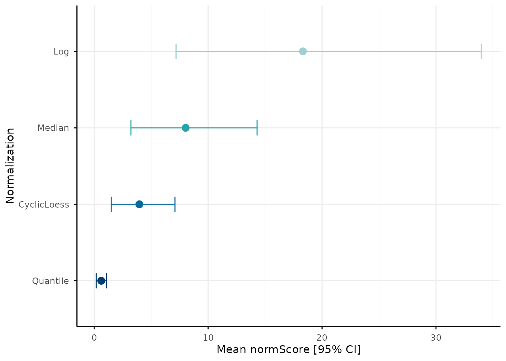
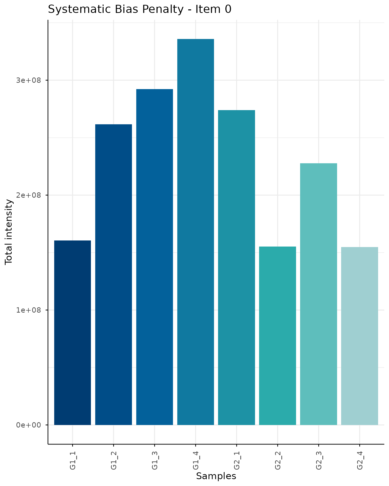
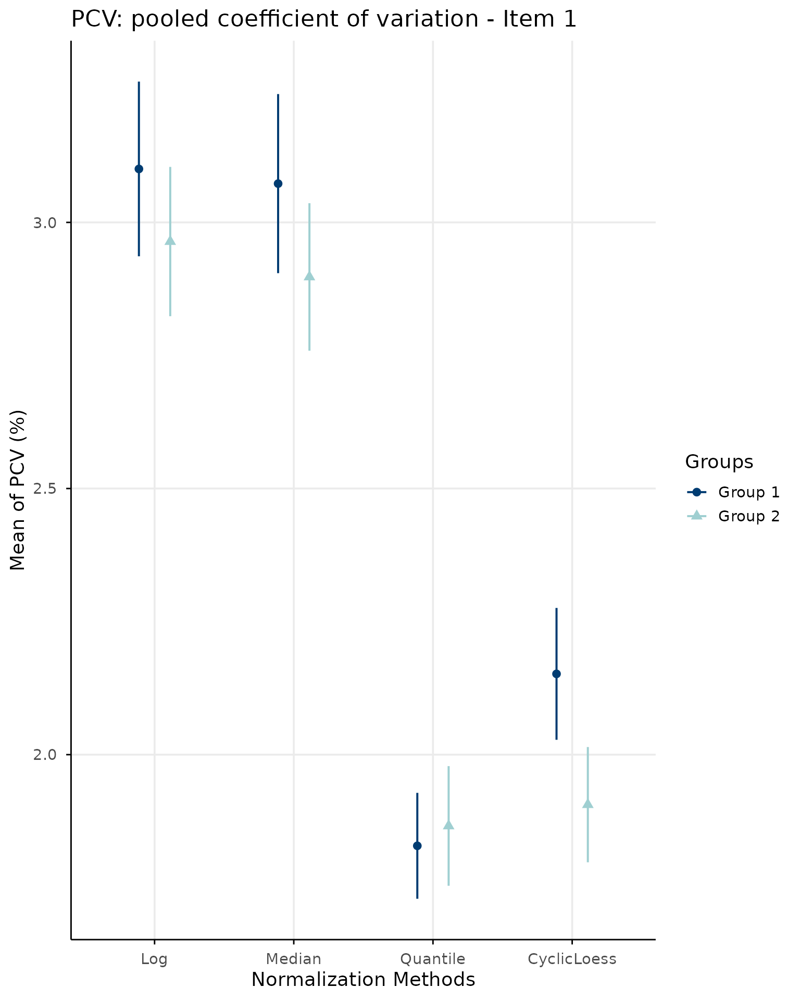
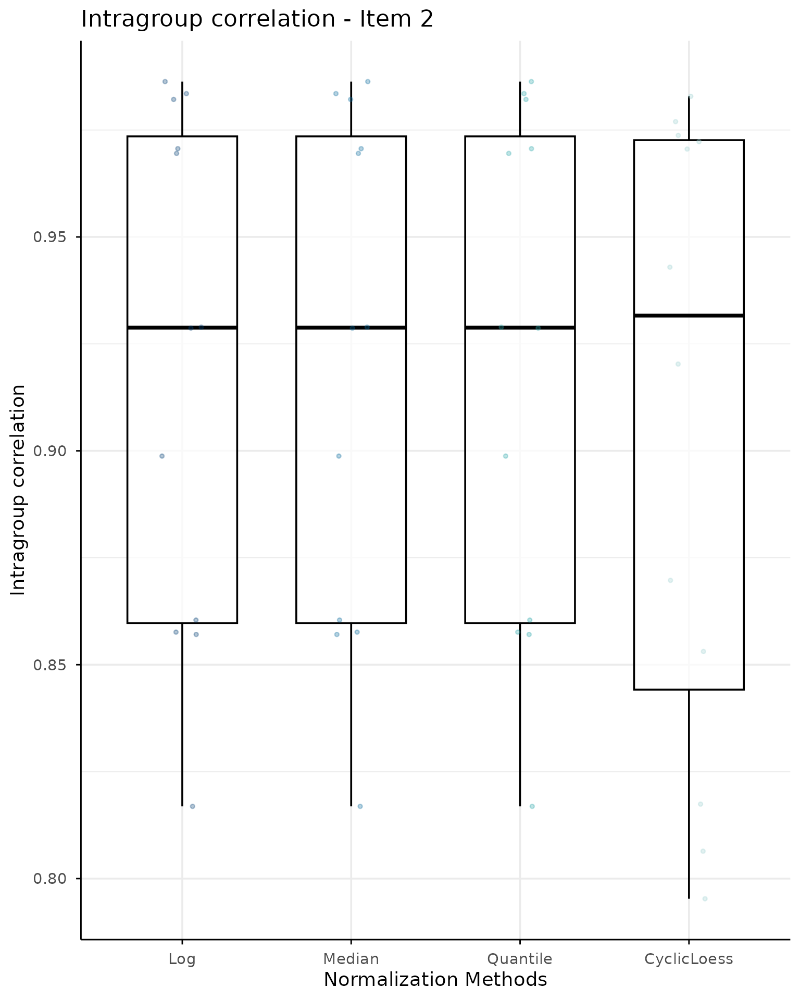
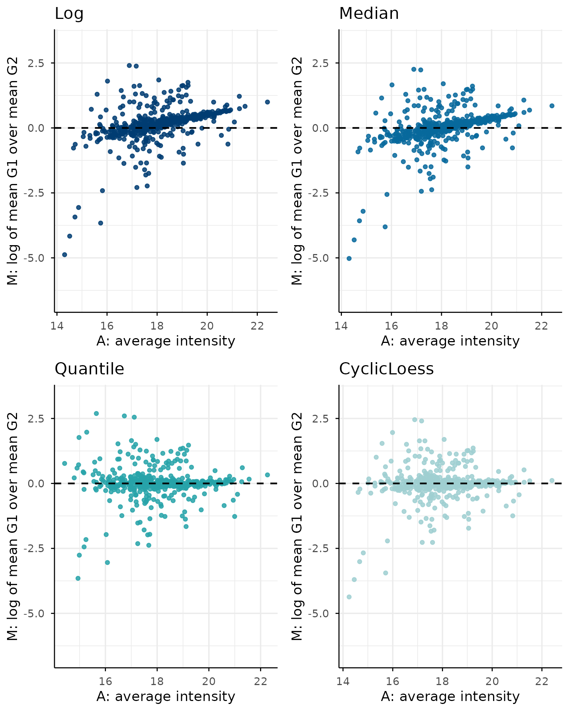
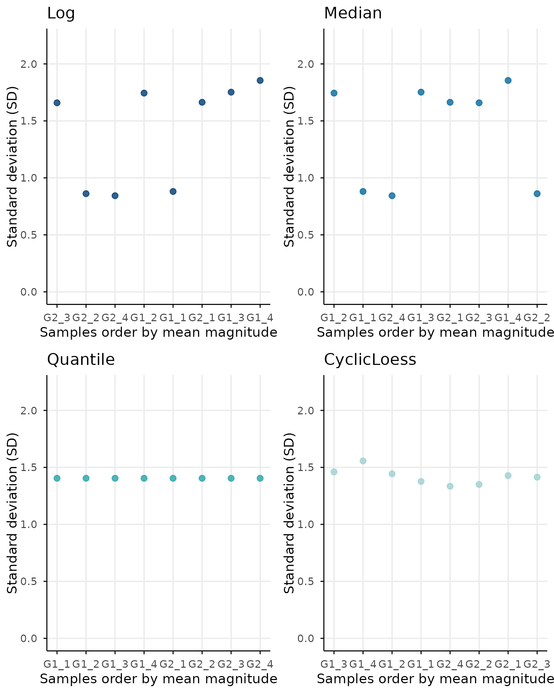
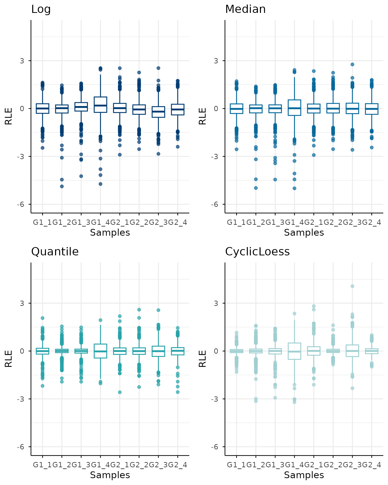
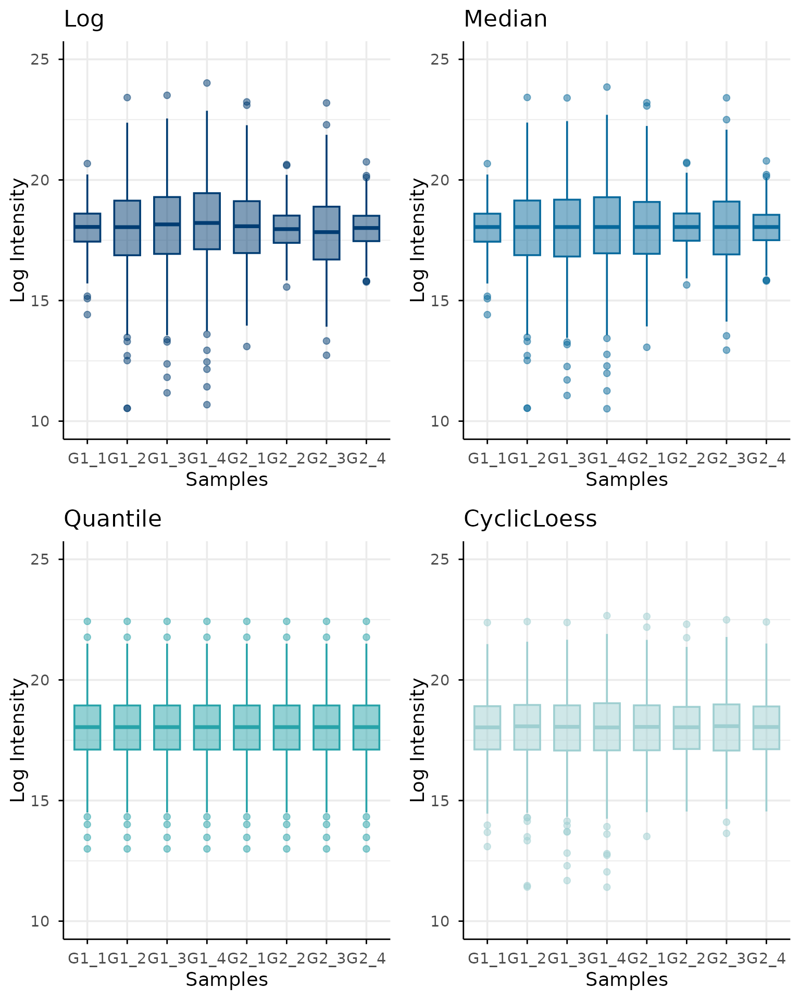

# Getting started with normScore

## Overview

`normScore` provides tools to evaluate and rank normalization methods
for omics data using a composite multi-metric scoring framework.

The package is designed to help compare different normalization
strategies based on several complementary criteria, including
variability, correlation structure, MA-trend behavior, relative log
expression consistency, and sample-level intensity consistency.

In this vignette, we show a minimal workflow using simulated data.

## Simulating example data

To keep the package lightweight and reproducible, `normScore` includes a
data simulation function that generates proteomics-like two-group
datasets.

``` r

library(normScore)

simData <- simulateData(
    nProteins = 500,
    nPerGroup = 4,
    sampleShiftSd = 0.12,
    sampleShiftCap = 1,
    sampleSdStrength = 1.2,
    sampleSdRho = 0.3,
    rhoWithin = 0.6,
    rhoBetween = 0.3,
    loadingSd = 0.45,
    sigmaHi = 0.03,
    sigmaLo = 0.4,
    gammaSigma = 3.8,
    kMnar = 1.6,
    addMissing = FALSE,
    seed = 123
)
```

The simulated object contains three main elements:

``` r

names(simData)
#> [1] "logData"  "rawData"  "metadata"
```

- `logData`: simulated data on the log2 scale
- `rawData`: simulated data on the raw scale
- `metadata`: sample annotation with group membership

We can inspect the sample metadata:

``` r

head(simData$metadata)
#>   Samples Groups
#> 1    G1_1     G1
#> 2    G1_2     G1
#> 3    G1_3     G1
#> 4    G1_4     G1
#> 5    G2_1     G2
#> 6    G2_2     G2
```

## Building a list of normalized datasets

The main function of the package,
[`normScore()`](https://juliagcurras.github.io/normScore/reference/normScore.md),
expects a named list of normalized datasets. Each element of the list
should be a matrix or data frame with the same rows (features) and
columns (samples).

For illustration purposes, we create a few simple variants of the
simulated log-scale data. In a real analysis, these would correspond to
different normalization methods.

``` r

# Median normalization
MedianMat <- NormalyzerDE::medianNormalization(simData$rawData)
colnames(MedianMat) <- colnames(simData$rawData)
rownames(MedianMat) <- rownames(simData$rawData)

# Quantile normalization
QuantileMat <- limma::normalizeQuantiles(
    simData$logData
)
colnames(QuantileMat) <- colnames(simData$logData)
rownames(QuantileMat) <- rownames(simData$logData)


# CyclicLoess normalization
CyclicNorm <- limma::normalizeCyclicLoess(
    simData$logData, method="fast",  adaptive.span=FALSE
)


# All together
normalizedDataList <- list(
    Log = simData$logData,
    Median = MedianMat,
    Quantile = QuantileMat, 
    CyclicLoess = CyclicNorm
)

names(normalizedDataList)
#> [1] "Log"         "Median"      "Quantile"    "CyclicLoess"
```

## Running `normScore()`

We now compute the normalization ranking.

``` r

result <- normScore(
    normalizedDataList = normalizedDataList,
    groupData = simData$metadata,
    rawData = simData$rawData,
    returnDetails = TRUE,
    nBoot = 150
)
#> Reference group set to G2.
#> Alternative group set to G1.
```

## Final ranking

The `finalRanking` element contains the final composite score for each
normalization method.

``` r

result$finalRanking
#>    Quantile CyclicLoess      Median         Log 
#>   0.2166984   1.3760648   2.7910586   5.9883198
```

Lower values indicate better normalization performance according to the
scoring framework implemented in the package.

## Detailed scores

The `detailRanking` element contains the scaled item-wise scores used to
build the final ranking.

``` r

result$detailRanking
#>                 Item1 Item2     Item3     Item4     Item5     Item6     Total
#> Quantile    0.0000000   0.0 0.0000000 0.0000000 0.2166984 0.0000000 0.2166984
#> CyclicLoess 0.1531998   0.1 0.2041703 0.1741166 0.6298636 0.1147144 1.3760648
#> Median      0.9602883   0.0 0.9576886 0.1415680 0.0000000 0.7315137 2.7910586
#> Log         1.0000000   0.0 1.0000000 1.0000000 1.0000000 1.0000000 5.0000000
#>             TotalxItem0
#> Quantile      0.2166984
#> CyclicLoess   1.3760648
#> Median        2.7910586
#> Log           5.9883198
```

The six item scores correspond to:

1.  pooled coefficient of variation
2.  within-group sample correlation
3.  MA-plot trend deviation
4.  mean-SD trend deviation
5.  RLE consistency
6.  total intensity consistency

These are scaled and combined into a final score.

## Bootstrap summary

If `returnDetails = TRUE`, the function also computes bootstrap-based
summary scores and confidence intervals.

``` r

result$bootstrapScore
#>   normalization meanNormScore      ll95      ul95
#> 1      Quantile     0.6197575 0.1722891  1.083492
#> 2   CyclicLoess     3.9641881 1.4912559  7.091613
#> 3        Median     8.0256886 3.2255385 14.299405
#> 4           Log    18.3192798 7.1859837 33.975258
```

This output contains:

- the normalization method name
- the mean bootstrap normScore
- the lower 95% confidence bound
- the upper 95% confidence bound

## Bootstrap plot

The bootstrap summary can also be visualized directly:

``` r

plotBootstrapNormScore(result)
```



## Diagnostic plots

Individual diagnostic plots from state-of-art normalization criteria can
be visualed with the following function:

- `allPlots`` ``<-`` `[`plotNormScoreDiagnostics`](https://juliagcurras.github.io/normScore/reference/plotNormScoreDiagnostics.md)`(`` `` normalizedDataList ``=`` ``normalizedDataList``,`` `` groupData ``=`` ``simData``$``metadata``,`` `` rawData ``=`` ``simData``$``rawData`` ``)`` ``#> Reference group set to G2.`` ``#> Alternative group set to G1.`` `` `[`names`](https://rdrr.io/r/base/names.html)`(``allPlots``)`` ``#> [1] "item0" "item1" "item2" "item3" "item4" "item5" "item6"`` `` ``# Plotting each in a different tab`
- item0
- item1
- item2
- item3
- item4
- item5
- item6















## Notes on the scoring framework

The
[`normScore()`](https://juliagcurras.github.io/normScore/reference/normScore.md)
function combines multiple complementary criteria into a single ranking.
This is useful because no single metric fully captures normalization
quality.

Some items emphasize within-group consistency, whereas others evaluate
distributional behavior or trend distortions introduced by
normalization.

The resulting score should therefore be interpreted as a comparative
measure across candidate normalization methods rather than as an
absolute quality index.

## Important considerations

Before running `normScore`, verify that:

- all assays contain the same rows and columns;
- feature and sample names are unique;
- the order of `groupData$Samples` matches the assay columns;
- missing values are represented consistently across assays;
- every sample has a valid group assignment.

## Session information

``` r

sessionInfo()
#> R version 4.6.1 (2026-06-24)
#> Platform: x86_64-pc-linux-gnu
#> Running under: Ubuntu 24.04.4 LTS
#> 
#> Matrix products: default
#> BLAS:   /usr/lib/x86_64-linux-gnu/openblas-pthread/libblas.so.3 
#> LAPACK: /usr/lib/x86_64-linux-gnu/openblas-pthread/libopenblasp-r0.3.26.so;  LAPACK version 3.12.0
#> 
#> locale:
#>  [1] LC_CTYPE=C.UTF-8       LC_NUMERIC=C           LC_TIME=C.UTF-8       
#>  [4] LC_COLLATE=C.UTF-8     LC_MONETARY=C.UTF-8    LC_MESSAGES=C.UTF-8   
#>  [7] LC_PAPER=C.UTF-8       LC_NAME=C              LC_ADDRESS=C          
#> [10] LC_TELEPHONE=C         LC_MEASUREMENT=C.UTF-8 LC_IDENTIFICATION=C   
#> 
#> time zone: UTC
#> tzcode source: system (glibc)
#> 
#> attached base packages:
#> [1] stats     graphics  grDevices utils     datasets  methods   base     
#> 
#> other attached packages:
#> [1] normScore_0.99.0
#> 
#> loaded via a namespace (and not attached):
#>  [1] SummarizedExperiment_1.42.0 gtable_0.3.6               
#>  [3] xfun_0.60                   bslib_0.11.0               
#>  [5] ggplot2_4.0.3               rstatix_1.1.0              
#>  [7] Biobase_2.72.0              lattice_0.22-9             
#>  [9] vctrs_0.7.3                 tools_4.6.1                
#> [11] generics_0.1.4              stats4_4.6.1               
#> [13] tibble_3.3.1                pkgconfig_2.0.3            
#> [15] Matrix_1.7-5                RColorBrewer_1.1-3         
#> [17] S7_0.2.2                    desc_1.4.3                 
#> [19] S4Vectors_0.50.1            lifecycle_1.0.5            
#> [21] compiler_4.6.1              farver_2.1.2               
#> [23] textshaping_1.0.5           statmod_1.5.2              
#> [25] Seqinfo_1.2.0               carData_3.0-6              
#> [27] htmltools_0.5.9             sass_0.4.10                
#> [29] yaml_2.3.12                 Formula_1.2-5              
#> [31] preprocessCore_1.74.0       car_3.1-5                  
#> [33] tidyr_1.3.2                 pkgdown_2.2.1              
#> [35] pillar_1.11.1               ggpubr_1.0.0               
#> [37] jquerylib_0.1.4             MASS_7.3-65                
#> [39] DelayedArray_0.38.2         cachem_1.1.0               
#> [41] limma_3.68.4                boot_1.3-32                
#> [43] abind_1.4-8                 NormalyzerDE_1.30.0        
#> [45] tidyselect_1.2.1            digest_0.6.39              
#> [47] dplyr_1.2.1                 purrr_1.2.2                
#> [49] labeling_0.4.3              cowplot_1.2.0              
#> [51] fastmap_1.2.0               grid_4.6.1                 
#> [53] cli_3.6.6                   SparseArray_1.12.2         
#> [55] magrittr_2.0.5              S4Arrays_1.12.0            
#> [57] broom_1.0.13                withr_3.0.3                
#> [59] backports_1.5.1             scales_1.4.0               
#> [61] rmarkdown_2.31              XVector_0.52.0             
#> [63] matrixStats_1.5.0           otel_0.2.0                 
#> [65] ggsignif_0.6.4              ragg_1.5.2                 
#> [67] evaluate_1.0.5              knitr_1.51                 
#> [69] GenomicRanges_1.64.0        IRanges_2.46.0             
#> [71] rlang_1.3.0                 glue_1.8.1                 
#> [73] BiocGenerics_0.58.1         jsonlite_2.0.0             
#> [75] R6_2.6.1                    MatrixGenerics_1.24.0      
#> [77] systemfonts_1.3.2           fs_2.1.0
```
